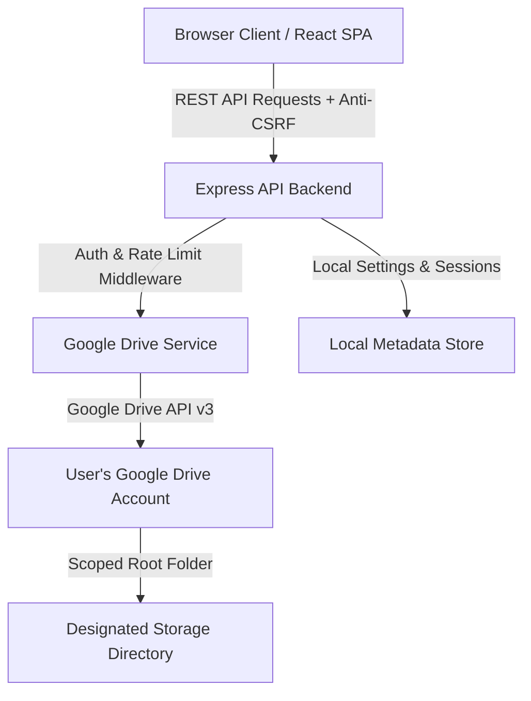

# Private Cloud File Manager

[](https://www.typescriptlang.org/)
[](https://react.dev/)
[](https://vitejs.dev/)
[](https://tailwindcss.com/)
[](https://nodejs.org/)
[](https://expressjs.com/)
[](https://developers.google.com/drive)

A self-hosted web application for managing files and folders stored in Google Drive while retaining control over your application deployment, user authentication, and storage configuration.

---

## Preview

<p align="center">
  
</p>

---

## Why This Project

Standard web storage interfaces often require hosting files directly on server local disks or using third-party software as a service. **Private Cloud File Manager** separates application deployment from file persistence.

By connecting your own Google Drive account via OAuth 2.0, you can run a private, responsive web dashboard on your own server (or local machine) while leveraging Google Drive infrastructure for backend file storage.

### Key Advantages
- **Self-Hosted Control:** Host the frontend and Express backend on your own server, Vercel, or web host.
- **Your Own Credentials:** Bring your own Google Cloud OAuth 2.0 Client credentials—no shared third-party API gateways.
- **Root Folder Boundary:** Restrict application file access to a specific designated folder in Google Drive.
- **No Direct Storage Burden:** Files are streamed directly between your browser, the backend server, and Google Drive without relying on server disk storage.

---

## Features

- **Google Drive Storage Management:** Upload, download, rename, move, and soft-delete files and folders.
- **Inline File Previews:** View PDFs, images, videos, and plain text files directly within the web app.
- **Markdown Notes Editor:** Create, edit, and organize `.md` text notes stored directly in your Google Drive.
- **Favorites & Recent Views:** Star important items and access recently modified files.
- **Workspace Search:** Search files and folders across your storage directory.
- **Layout & Sorting:** Switch between Grid and List views with multi-field sorting (name, date, size).
- **Keyboard Shortcuts:** Built-in productivity shortcuts (`Ctrl+K` search, `Ctrl+A` select all, `Delete`, `Enter`, `Escape`).
- **Server-Side Root Boundary Enforcement:** Server validates folder hierarchies to ensure operations cannot access files outside your designated root folder.
- **Administrator Security:** Password hashing via bcrypt, rate limiting, IP brute-force protection, HTTP-only session cookies, and security headers via Helmet.
- **First-Run Setup Wizard:** Interactive step-by-step setup at `/setup` to initialize admin credentials, configure Google OAuth, and select or create a root storage folder.

---

## Technology Stack

### Frontend
- **React 18:** Single Page Application interface.
- **TypeScript 5:** Type-safe components and state management.
- **Vite 6:** Fast frontend build tool and dev server.
- **Tailwind CSS 3:** Styling and design system.
- **Lucide React:** Icons.
- **Marked:** Markdown parser for the Notes editor.
- **Axios:** HTTP client for REST API communication.

### Backend
- **Node.js:** JavaScript runtime.
- **Express 4:** REST API server.
- **TypeScript 5:** Server-side application logic.
- **Google APIs Client (`googleapis` v144):** Official SDK for Google Drive API v3.
- **Multer:** Multipart file upload handling.
- **BcryptJS:** Secure password hashing.
- **Express Session & Session File Store:** Server-side session management.
- **Helmet:** Security header middleware.
- **Express Rate Limit:** Request rate limiting protection.

### Storage & Integration
- **Google Drive API v3:** Primary file storage backend.
- **OAuth 2.0:** User authorization code flow.
- **JSON Metadata Store:** Lightweight local JSON store (`server/data/app_metadata.json`) for application settings and administrator metadata.

---

## Architecture



### Data Separation Model
- **Application Metadata:** Administrator account credentials, application configuration, session data, and note metadata are stored in the server metadata database.
- **File Contents & Directory Structure:** All uploaded files, folders, and markdown note text contents are stored directly inside your Google Drive account under the configured root folder.

---

## Security Model

### Server-Side Root Boundary Enforcement
When Private Cloud File Manager is configured with a Google Drive Root Folder ID, the backend enforces server-side boundary checks (`validateRootBoundary`):
- Every file or folder operation (list, upload, rename, move, delete, stream) checks parent chain references.
- Access is granted only if the target file or folder resides within the designated root folder hierarchy.
- Direct file ID manipulation attempts for files outside the root boundary are denied at the API controller layer.

### Authentication & Session Security
- **Administrator Credentials:** Stored securely using bcrypt password hashing.
- **Session Protection:** Session state is managed server-side using HTTP-only, `SameSite=Lax` session cookies with auto-generated 32-byte secret keys.
- **Inactivity Timeout:** Configurable session expiration (`SESSION_TIMEOUT`, default 60 minutes).
- **Anti-CSRF Controls:** Anti-CSRF token header validation on state-modifying REST endpoints.
- **Brute-Force Protection:** Automatically locks out client IP addresses after 5 consecutive failed login attempts.
- **One-Time Setup Lock:** Once first-run setup is completed, the `/setup` wizard route is permanently disabled.

---

## Google Cloud OAuth 2.0 Setup

To connect Private Cloud File Manager to your Google Drive:

1. Log in to the [Google Cloud Console](https://console.cloud.google.com/).
2. Create a new project (e.g., `Private Cloud Storage`).
3. Navigate to **APIs & Services > Library**, search for **Google Drive API**, and click **Enable**.
4. Configure the **OAuth Consent Screen** (User Type: *External* or *Internal*).
5. Navigate to **APIs & Services > Credentials** and click **Create Credentials > OAuth client ID**.
6. Select **Web application** as the Application Type.
7. Under **Authorized redirect URIs**, add your application callback URL:
   - For Local development: `http://localhost:5000/api/setup/oauth/callback`
   - For Vercel deployment: `https://<your-project>.vercel.app/api/setup/oauth/callback`
   - For Custom Domain: `https://yourdomain.com/api/setup/oauth/callback`
8. Copy your **Client ID** and **Client Secret**.

*(The built-in setup wizard at `/setup` and `/setup/google-oauth-guide` dynamically detects and displays the exact callback URL for your current domain).*

---

## Local Installation & Setup

### Prerequisites
- **Node.js**: v18.x, v20.x, or v22.x
- **npm**: v9.x or higher

### Step-by-Step Local Setup

1. **Clone the repository:**
   ```bash
   git clone https://github.com/sameerahmad005/Private-Cloud-File-Manager.git
   cd Private-Cloud-File-Manager
   ```

2. **Install all dependencies:**
   ```bash
   npm install
   ```

3. **Configure Environment Variables:**
   ```bash
   cp .env.example .env
   ```
   Edit `.env` and specify:
   ```env
   APP_ENV=development
   PORT=5000
   APP_URL=http://localhost:5000
   SESSION_SECRET=your_secret_key_32_characters_long
   AUTH_ENABLED=true
   STORAGE_PROVIDER=google_drive
   ```

4. **Run Development Servers:**
   ```bash
   # Terminal 1: Express API Server (Watch mode on port 5000)
   npm run dev:server

   # Terminal 2: React Frontend (Vite on port 5173)
   npm run dev:client
   ```

5. **First-Run Setup:**
   - Open `http://localhost:5173/setup` (or `http://localhost:5000/setup`).
   - Create your administrator user.
   - Enter your Google Client ID and Secret.
   - Authorize access and select/create your Google Drive root folder.

---

## Production Deployment

### 1. Vercel Serverless Deployment

Deploy both the React frontend and Express serverless functions under a single unified Vercel project:

1. **Import to Vercel:**
   - Go to [Vercel Dashboard](https://vercel.com/dashboard) and click **Add New > Project**.
   - Select your GitHub repository: `sameerahmad005/Private-Cloud-File-Manager`.

2. **Configure Build Settings:**
   - **Framework Preset**: `Other`
   - **Root Directory**: `./` (leave at repository root)
   - **Build Command**: `npm run build`
   - **Output Directory**: `client/dist`
   - **Install Command**: `npm install`

3. **Configure Environment Variables in Vercel:**
   In **Project Settings > Environment Variables**, add:
   | Variable | Value / Description |
   | :--- | :--- |
   | `APP_ENV` | `production` |
   | `APP_URL` | `https://<your-project>.vercel.app` |
   | `SESSION_SECRET` | 32+ character random string |
   | `AUTH_ENABLED` | `true` |
   | `ADMIN_USERNAME` | Administrator username (e.g. `admin`) |
   | `ADMIN_PASSWORD` | Strong password for admin login |
   | `STORAGE_PROVIDER` | `google_drive` |
   | `GOOGLE_CLIENT_ID` | Your Google OAuth Web Client ID |
   | `GOOGLE_CLIENT_SECRET` | Your Google OAuth Client Secret |
   | `GOOGLE_REFRESH_TOKEN` | (Optional: prefill or configure via setup) |
   | `GOOGLE_DRIVE_ROOT_FOLDER_ID` | (Optional: root folder ID or `root`) |

4. **Add Google OAuth Callback URI:**
   - In [Google Cloud Console Credentials](https://console.cloud.google.com/apis/credentials), add:
     ```
     https://<your-project>.vercel.app/api/setup/oauth/callback
     ```

5. **Deploy:** Click **Deploy**.

---

### 2. Standard Node.js Server / VPS
1. Run `npm install` and `npm run build`.
2. Configure production variables in `.env`.
3. Start the server using PM2 or Node:
   ```bash
   npm start
   ```

---

### 3. cPanel / Web Hosting (Phusion Passenger)
- Set application root to project directory.
- Point Passenger startup file to `app.js`.
- Run `npm install` and `npm run build`.

---

## Environment Variables Reference

| Variable | Required | Default | Description |
|---|---|---|---|
| `APP_ENV` | Optional | `development` | Environment mode (`development` / `production`). |
| `APP_URL` | Recommended | `http://localhost:5000` | Public base URL of your application. |
| `PORT` | Optional | `5000` | HTTP port for the backend server. |
| `AUTH_ENABLED` | Optional | `true` | Enable administrator authentication. |
| `SESSION_SECRET` | Recommended | Auto-generated | Secret key for encrypting session cookies. |
| `STORAGE_PROVIDER` | Optional | `google_drive` | Storage provider (`google_drive` / `virtual`). |
| `GOOGLE_CLIENT_ID` | Required* | Empty | Google OAuth 2.0 Client ID. |
| `GOOGLE_CLIENT_SECRET` | Required* | Empty | Google OAuth 2.0 Client Secret. |
| `GOOGLE_REFRESH_TOKEN` | Required* | Empty | Google OAuth 2.0 Refresh Token. |
| `GOOGLE_DRIVE_ROOT_FOLDER_ID` | Optional | `root` | Designated Google Drive root folder ID. |
| `MAX_UPLOAD_SIZE` | Optional | `52428800` | Max file upload size in bytes (50MB). |
| `SESSION_TIMEOUT` | Optional | `60` | Inactivity timeout in minutes. |
| `RATE_LIMIT` | Optional | `100` | Max requests per 15 minutes per IP. |

---

## Keyboard Shortcuts

| Shortcut | Context | Action |
|---|---|---|
| `Ctrl + K` / `⌘ + K` | Global | Focus search input. |
| `Ctrl + A` / `⌘ + A` | Explorer | Select all items in current folder. |
| `Ctrl + Shift + A` | Explorer | Deselect all items. |
| `Delete` | Explorer | Open deletion modal for selected items. |
| `Enter` | Explorer | Open preview or navigate into folder. |
| `Escape` | Global | Close modals, menus, and search. |

---

## Project Structure

```
Private-Cloud-File-Manager/
├── client/                     # Frontend React + TypeScript SPA
│   ├── src/
│   │   ├── components/         # Reusable UI components & modals
│   │   ├── context/            # Auth & Theme context providers
│   │   ├── pages/              # Drive, Notes, Settings, Setup views
│   │   └── services/           # Axios REST API client
│   ├── package.json
│   ├── vercel.json             # Client SPA fallback rewrites
│   └── vite.config.ts
├── server/                     # Backend Express + TypeScript API server
│   ├── src/
│   │   ├── config/             # Environment configuration (env.ts)
│   │   ├── controllers/        # REST API controllers
│   │   ├── database/           # Metadata JSON store (db.ts)
│   │   ├── middleware/         # Auth, Rate limiting, Security headers
│   │   ├── services/           # Google Drive API v3 integration
│   │   └── index.ts            # Express server entry point
│   ├── package.json
│   └── tsconfig.json
├── shared/                     # Shared TypeScript interfaces
├── api/                        # Vercel Serverless entry point (index.js)
├── app.js                      # Universal cPanel / Node.js entry point
├── vercel.json                 # Unified Vercel serverless & SPA configuration
├── .env.example                # Template environment file
├── package.json                # Root workspaces configuration
└── README.md
```

---

## Troubleshooting

- **Google Drive Disconnected:** Verify your `GOOGLE_CLIENT_ID`, `GOOGLE_CLIENT_SECRET`, and `GOOGLE_REFRESH_TOKEN` or visit `/setup`.
- **Invalid Redirect URI:** Ensure the callback URL displayed in `/setup` exactly matches **Authorized redirect URIs** in Google Cloud Console.
- **Port In Use:** Change `PORT=5000` to `PORT=5001` in your `.env`.

---

## Author & Attribution

Made by **Sameer Ahmad**

GitHub: [https://github.com/sameerahmad005/Private-Cloud-File-Manager](https://github.com/sameerahmad005/Private-Cloud-File-Manager)
