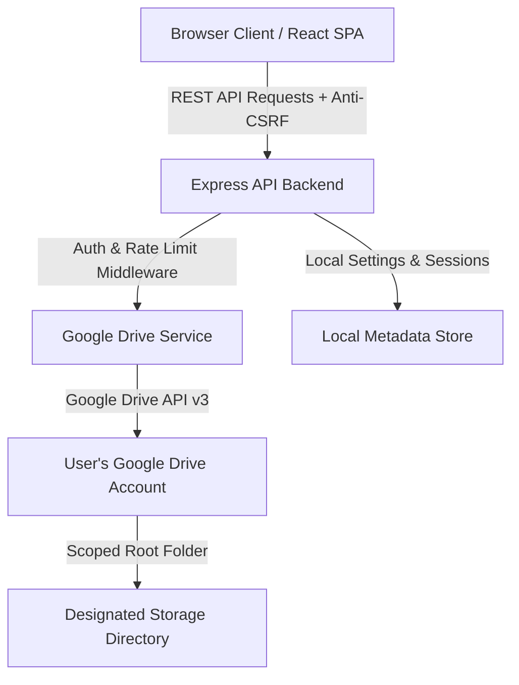

# Private Cloud File Manager

[](https://www.typescriptlang.org/)
[](https://react.dev/)
[](https://vitejs.dev/)
[](https://tailwindcss.com/)
[](https://nodejs.org/)
[](https://expressjs.com/)
[](https://developers.google.com/drive)

A self-hosted web application for managing files and folders stored in Google Drive while retaining control over your application deployment, user authentication, and storage configuration.

---

## Preview

<p align="center">
  
</p>

---

## Why This Project

Standard web storage interfaces often require hosting files directly on server local disks or using third-party software as a service. **Private Cloud File Manager** separates application deployment from file persistence.

By connecting your own Google Drive account via OAuth 2.0, you can run a private, responsive web dashboard on your own server (or local machine) while leveraging Google Drive infrastructure for backend file storage.

### Key Advantages
- **Self-Hosted Control:** Host the frontend and Express backend on your own server or web host.
- **Your Own Credentials:** Bring your own Google Cloud OAuth 2.0 Client credentials—no shared third-party API gateways.
- **Root Folder Boundary:** Restrict application file access to a specific designated folder in Google Drive.
- **No Direct Storage Burden:** Files are streamed directly between your browser, the backend server, and Google Drive without relying on server disk storage.

---

## Features

- **Google Drive Storage Management:** Upload, download, rename, move, and soft-delete files and folders.
- **Inline File Previews:** View PDFs, images, videos, and plain text files directly within the web app.
- **Markdown Notes Editor:** Create, edit, and organize `.md` text notes stored directly in your Google Drive.
- **Favorites & Recent Views:** Star important items and access recently modified files.
- **Workspace Search:** Search files and folders across your storage directory.
- **Layout & Sorting:** Switch between Grid and List views with multi-field sorting (name, date, size).
- **Keyboard Shortcuts:** Built-in productivity shortcuts (`Ctrl+K` search, `Ctrl+A` select all, `Delete`, `Enter`, `Escape`).
- **Server-Side Root Boundary Enforcement:** Server validates folder hierarchies to ensure operations cannot access files outside your designated root folder.
- **Administrator Security:** Password hashing via bcrypt, rate limiting, IP brute-force protection, HTTP-only session cookies, and security headers via Helmet.
- **First-Run Setup Wizard:** Interactive step-by-step setup at `/setup` to initialize admin credentials, configure Google OAuth, and select or create a root storage folder.

---

## Technology Stack

### Frontend
- **React 18:** Single Page Application interface.
- **TypeScript 5:** Type-safe components and state management.
- **Vite 6:** Fast frontend build tool and dev server.
- **Tailwind CSS 3:** Styling and design system.
- **Lucide React:** Icons.
- **Marked:** Markdown parser for the Notes editor.
- **Axios:** HTTP client for REST API communication.

### Backend
- **Node.js:** JavaScript runtime.
- **Express 4:** REST API server.
- **TypeScript 5:** Server-side application logic.
- **Google APIs Client (`googleapis` v144):** Official SDK for Google Drive API v3.
- **Multer:** Multipart file upload handling.
- **BcryptJS:** Secure password hashing.
- **Express Session & Session File Store:** Server-side session management.
- **Helmet:** Security header middleware.
- **Express Rate Limit:** Request rate limiting protection.

### Storage & Integration
- **Google Drive API v3:** Primary file storage backend.
- **OAuth 2.0:** User authorization code flow.
- **JSON Metadata Store:** Lightweight local JSON store (`server/data/app_metadata.json`) for application settings and administrator metadata.

---

## Architecture



### Data Separation Model
- **Application Metadata:** Administrator account credentials, application configuration, session data, and note metadata are stored in the local server metadata database.
- **File Contents & Directory Structure:** All uploaded files, folders, and markdown note text contents are stored directly inside your Google Drive account under the configured root folder.

---

## Security Model

### Server-Side Root Boundary Enforcement
When Private Cloud File Manager is configured with a Google Drive Root Folder ID, the backend enforces server-side boundary checks (`validateRootBoundary`):
- Every file or folder operation (list, upload, rename, move, delete, stream) checks parent chain references.
- Access is granted only if the target file or folder resides within the designated root folder hierarchy.
- Direct file ID manipulation attempts for files outside the root boundary are denied at the API controller layer.

---

## Authentication & Session Security

- **Administrator Credentials:** Stored securely using bcrypt password hashing.
- **Session Protection:** Session state is managed server-side using HTTP-only, `SameSite=Lax` session cookies with auto-generated 32-byte secret keys.
- **Inactivity Timeout:** Configurable session expiration (`SESSION_TIMEOUT`, default 60 minutes).
- **Anti-CSRF Controls:** Anti-CSRF token header validation on state-modifying REST endpoints.
- **Brute-Force Protection:** Automatically locks out client IP addresses after 5 consecutive failed login attempts.
- **One-Time Setup Lock:** Once first-run setup is completed, the `/setup` wizard route is permanently disabled.

---

## Google OAuth Setup

To connect Private Cloud File Manager to your Google Drive, you need your own Google Cloud OAuth 2.0 credentials:

1. Log in to the [Google Cloud Console](https://console.cloud.google.com/).
2. Create a new project (e.g., `Private Cloud Storage`).
3. Navigate to **APIs & Services > Library**, search for **Google Drive API**, and click **Enable**.
4. Configure the **OAuth Consent Screen** (User Type: *External* or *Internal*).
5. Navigate to **APIs & Services > Credentials** and click **Create Credentials > OAuth client ID**.
6. Select **Web application** as the Application Type.
7. Under **Authorized redirect URIs**, add your application callback URL:
   - For local development: `http://localhost:5000/api/setup/oauth/callback`
   - For production deployment: `https://your-domain.com/api/setup/oauth/callback`
8. Copy your **Client ID** and **Client Secret**.
9. Enter these credentials during the first-run `/setup` wizard or configure them in your server environment.

*(An interactive guide is also built into the application at `/setup/google-oauth-guide`).*

---

## Installation

### Prerequisites
- **Node.js:** v18.0.0 or higher
- **npm:** v9.0.0 or higher

### 1. Clone the Repository
```bash
git clone https://github.com/sameerahmad005/Private-Cloud-File-Manager.git
cd Private-Cloud-File-Manager
```

### 2. Install Dependencies
```bash
# Install root dependencies
npm install
```

### 3. Build Client & Server
```bash
npm run build
```

---

## First-Run Setup

1. Copy `.env.example` to `.env`:
   ```bash
   cp .env.example .env
   ```

2. Start the production server:
   ```bash
   npm start
   ```

3. Open your browser and navigate to:
   ```
   http://localhost:5000/setup
   ```

4. Complete the 6-step setup wizard:
   * **Step 1 — Welcome:** Architecture overview and environment check.
   * **Step 2 — Admin Account:** Create your administrator username and password.
   * **Step 3 — OAuth Credentials:** Enter your Google Client ID and Client Secret.
   * **Step 4 — Connect Google Account:** Authorize Google Drive access via OAuth 2.0.
   * **Step 5 — Root Folder:** Select an existing folder or create a new dedicated folder (e.g., `Private Cloud`).
   * **Step 6 — Review & Finish:** Review parameters and finalize setup.

Once setup is complete, the application locks `/setup` and redirects to the login screen.

---

## Environment Variables

Configure application parameters in `.env`:

| Variable | Required | Default | Description |
|---|---|---|---|
| `APP_ENV` | Optional | `development` | Environment mode (`development` / `production`). |
| `APP_URL` | Optional | `http://localhost:5000` | Public base URL of your application. |
| `PORT` | Optional | `5000` | HTTP port for the backend server. |
| `AUTH_ENABLED` | Optional | `true` | Enable or disable administrator authentication. |
| `SESSION_SECRET` | Recommended | Auto-generated | Secret key for encrypting server session cookies. |
| `STORAGE_PROVIDER` | Optional | `google_drive` | Storage engine (`google_drive` or `virtual` for testing). |
| `GOOGLE_CLIENT_ID` | Required* | Empty | Google OAuth 2.0 Client ID (or configured via `/setup`). |
| `GOOGLE_CLIENT_SECRET` | Required* | Empty | Google OAuth 2.0 Client Secret (or configured via `/setup`). |
| `GOOGLE_REFRESH_TOKEN` | Required* | Empty | Google OAuth 2.0 Refresh Token (generated during setup). |
| `MAX_UPLOAD_SIZE` | Optional | `52428800` | Maximum file upload size in bytes (default: 50MB). |
| `SESSION_TIMEOUT` | Optional | `60` | Session inactivity timeout in minutes. |
| `RATE_LIMIT` | Optional | `100` | Maximum requests per 15 minutes per IP address. |

---

## Keyboard Shortcuts

Private Cloud File Manager includes a global keyboard shortcut system:

| Shortcut | Context | Action |
|---|---|---|
| `Ctrl + K` / `⌘ + K` | Global | Focus global search input and select query text. |
| `Ctrl + A` / `⌘ + A` | Explorer | Select all visible files and folders in active folder view. |
| `Ctrl + Shift + A` / `⌘ + Shift + A` | Explorer | Deselect all files and folders. |
| `Delete` | Explorer | Open deletion modal for currently selected item(s). |
| `Enter` | Explorer | Open selected file preview or navigate into selected folder. |
| `Escape` | Global | Close search dropdowns, right-click menus, and modals. |

*Note: `Ctrl+A` is scoped exclusively to the file manager view and does not interfere with standard text selection in inputs, textareas, or the Markdown notes editor.*

---

## Project Structure

```
Private-Cloud-File-Manager/
├── client/                     # Frontend React + TypeScript application
│   ├── src/
│   │   ├── components/         # Reusable UI components & modals
│   │   ├── context/            # React context providers (Auth, Theme)
│   │   ├── hooks/              # Custom hooks (useKeyboardShortcuts)
│   │   ├── pages/              # Page views (Drive, Notes, Settings, Setup)
│   │   └── services/           # Axios REST API client
│   ├── package.json
│   └── vite.config.ts
├── server/                     # Backend Express + TypeScript API server
│   ├── src/
│   │   ├── config/             # Environment configuration (env.ts)
│   │   ├── controllers/        # REST API route controllers
│   │   ├── database/           # Local JSON metadata database (db.ts)
│   │   ├── middleware/         # Auth, Rate limiting, and Security headers
│   │   ├── scripts/            # CLI token generation helper (getOAuthToken.ts)
│   │   ├── services/           # Google Drive API v3 integration service
│   │   └── index.ts            # Main Express application entry point
│   ├── package.json
│   └── tsconfig.json
├── shared/                     # Shared TypeScript types & interfaces
├── api/                        # Vercel Serverless Function entry point (index.js)
├── app.js                      # Universal cPanel / Node.js entry script
├── vercel.json                 # Vercel deployment & SPA routing configuration
├── .env.example                # Template environment file
├── package.json                # Root package configuration
└── README.md
```

---

## Development

### Running Development Servers
To run the Express backend and React frontend concurrently in development mode:

```bash
# Terminal 1: Backend Express server (watch mode on port 5000)
npm run dev:server

# Terminal 2: Frontend Vite dev server (on port 5173)
npm run dev:client
```

### Running Automated Tests
```bash
npm test
```

### Building for Production
```bash
npm run build
```

---

## Production Deployment

### Vercel Serverless Deployment
1. Import the repository into **Vercel**.
2. Keep the **Root Directory** as `./` (repository root).
3. Vercel will automatically detect `vercel.json` (build command `npm run build`, output directory `client/dist`, and API/SPA rewrites).
4. Configure required Environment Variables in Vercel Project Settings (`APP_URL`, `SESSION_SECRET`, `GOOGLE_CLIENT_ID`, `GOOGLE_CLIENT_SECRET`, `GOOGLE_REFRESH_TOKEN`, `GOOGLE_DRIVE_ROOT_FOLDER_ID`).
5. Add `https://<your-vercel-domain>/api/setup/oauth/callback` to **Authorized redirect URIs** in Google Cloud Console.

### Standard Node.js Server
1. Clone repository and run `npm install`.
2. Run `npm run build` to compile client and server assets.
3. Configure `.env` with production `APP_URL`, `SESSION_SECRET`, and port.
4. Run `npm start` (or use a process manager like PM2).

### Web Hosting / cPanel (Phusion Passenger)
The repository includes an `app.js` entry script designed for cPanel Node.js selector / Phusion Passenger environments. Point Passenger's startup file to `app.js`.

---

## Configuration Security

- **Never commit `.env`** to Git repositories.
- Keep `GOOGLE_CLIENT_SECRET`, `GOOGLE_REFRESH_TOKEN`, and `SESSION_SECRET` confidential.
- Use `.env.example` as a template for environment variable configuration.
- Server-side sessions and credentials must remain restricted to your backend environment.

---

## Troubleshooting

- **Google Drive Not Connected:** Ensure `GOOGLE_CLIENT_ID`, `GOOGLE_CLIENT_SECRET`, and `GOOGLE_REFRESH_TOKEN` are populated or re-run setup at `/setup`.
- **Invalid Redirect URI:** Verify that `http://localhost:5000/api/setup/oauth/callback` (or your domain callback) exactly matches the **Authorized redirect URIs** in Google Cloud Console.
- **Permission Denied Errors:** Ensure your Google Account has access permissions to the configured root folder.
- **Port 5000 In Use:** Change `PORT=5000` in `.env` to an open port (e.g. `PORT=5001`).

---

## Roadmap

- Additional automated test coverage across storage service edge cases.
- Production deployment guides for Docker and cloud hosting platforms.
- Extended administrative policy management controls.

---

## Contributing

Contributions are welcome! To contribute:

1. Fork the repository.
2. Create a feature branch (`git checkout -b feature/your-feature`).
3. Make your changes and verify with `npm run build` and `npm test`.
4. Commit your changes with clear messages.
5. Push to your branch and open a Pull Request.

---

## Security Reporting

If you discover a potential security vulnerability in Private Cloud File Manager, please report it responsibly by contacting the repository maintainer through GitHub or private channels. Do not post unpatched security vulnerabilities in public issue trackers.

---

## License

License information will be added separately.

---

## Author & Attribution

Made by **Sameer Ahmad**

GitHub: [https://github.com/sameerahmad005/Private-Cloud-File-Manager](https://github.com/sameerahmad005/Private-Cloud-File-Manager)
